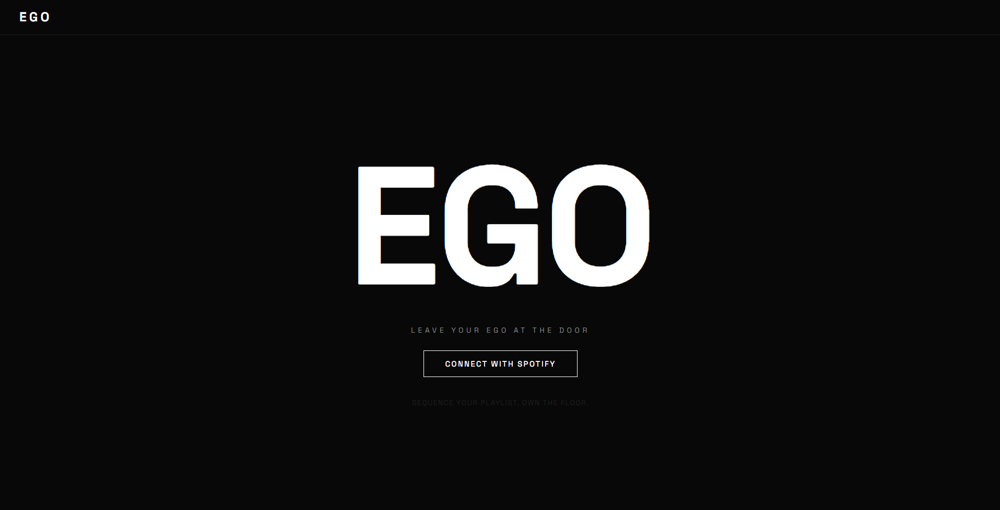
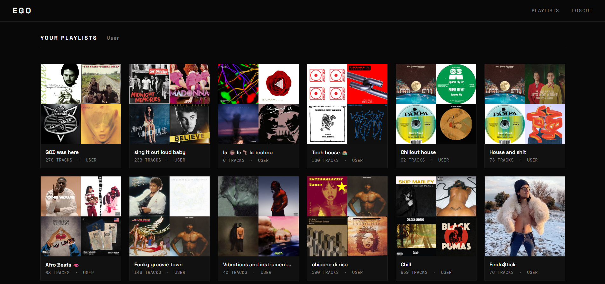
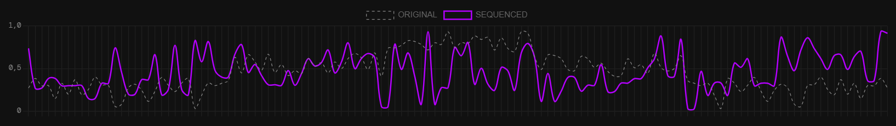

```
███████╗ ██████╗  ██████╗
██╔════╝██╔════╝ ██╔═══██╗
█████╗  ██║  ███╗██║   ██║
██╔══╝  ██║   ██║██║   ██║
███████╗╚██████╔╝╚██████╔╝
╚══════╝ ╚═════╝  ╚═════╝
```

**LEAVE YOUR EGO AT THE DOOR**

---

EGO is a web tool for DJs that takes an existing Spotify playlist and reorders it following different narrative arcs — from smooth BPM climbs to peak-and-drop structures.
Built for DJs who care about set flow, not just track selection.
Connect your Spotify account, pick a playlist, choose a sequencing mode, and save the result back to Spotify in one click.

---

## Screenshots

| Landing | Playlists |
|---|---|
|  |  |

| Sequence Mode | Energy Comparison |
|---|---|
|  |  |

---

## Features

| Mode | Description |
|---|---|
| **BPM Ascending** | Sorts tracks from lowest to highest tempo. Ideal for a steady, linear energy build. |
| **Energy Ascending** | Sorts by energy score, from chill to intense. |
| **Peak & Drop** | Classic DJ arc: low energy intro → mid build → peak → mid descent → outro. Bands are sorted by BPM internally for smooth transitions. |
| **Valence Ascending** | Sorts from darkest/saddest to most euphoric. Works well for emotional journey sets. |
| **Smart Mix** | Greedy nearest-neighbour algorithm using a combined score `(energy × 0.5 + tempo_normalized × 0.5)`. Minimises abrupt jumps between consecutive tracks for a natural flow. |

---

## How it works

```
Spotify Account
      │
      ▼
  OAuth Login
      │
      ▼
 Pick one of your playlists
      │
      ▼
 Fetch Tracks + Audio Features
 (BPM from Deezer API · energy/valence estimated)
      │
      ▼
 Choose Sequencing Mode
      │
      ├── BPM Ascending
      ├── Energy Ascending
      ├── Peak & Drop
      ├── Valence Ascending
      └── Smart Mix
            │
            ▼
     Preview: Original vs Sequenced
     (overlaid Chart.js energy curves)
            │
            ▼
   Save to Spotify
   ┌──────────────────────┐
   │  Overwrite original  │
   │  Save as new "EGO —" │
   └──────────────────────┘
```

---

## Getting Started

### Prerequisites

- Python 3.11+
- A Spotify account (free or premium)
- A Spotify Developer application ([create one here](https://developer.spotify.com/dashboard))

### Spotify Developer Setup

1. Go to [Spotify Developer Dashboard](https://developer.spotify.com/dashboard)
2. Click **Create app**
3. Fill in any name and description
4. Under **Redirect URIs**, add: `http://localhost:5000/callback`
5. Save — copy your **Client ID** and **Client Secret**

> The Redirect URI must match exactly — no trailing slash.

### Installation

```bash
# Clone the repository
git clone https://github.com/giuliamazzotti2/EGO---Leave-your-ego-at-the-door.git
cd EGO---Leave-your-ego-at-the-door

# Create and activate a virtual environment
python -m venv venv

# Windows
venv\Scripts\activate
# macOS / Linux
source venv/bin/activate

# Install dependencies
pip install -r requirements.txt

# Configure environment variables
cp .env.example .env
# Edit .env with your Spotify credentials and a random secret key
```

### Environment variables (`.env`)

```
SPOTIFY_CLIENT_ID=your_spotify_client_id_here
SPOTIFY_CLIENT_SECRET=your_spotify_client_secret_here
SPOTIFY_REDIRECT_URI=http://localhost:5000/callback
FLASK_SECRET_KEY=any_long_random_string
```

Generate a secure `FLASK_SECRET_KEY` with:
```bash
python -c "import secrets; print(secrets.token_hex(32))"
```

### Run

```bash
python app.py
```

Open [http://localhost:5000](http://localhost:5000) in your browser.

---

## Spotify OAuth Setup

EGO uses the **Authorization Code Flow** — the user is redirected to Spotify to grant permission, then redirected back to the app.

The **Redirect URI** in your Spotify Developer Dashboard must match `SPOTIFY_REDIRECT_URI` in `.env` exactly.

For local development: `http://localhost:5000/callback`

For production, update both to your domain: `https://your-domain.com/callback`

Required OAuth scopes:
- `playlist-read-private`
- `playlist-read-collaborative`
- `playlist-modify-public`
- `playlist-modify-private`

### Using ngrok for local OAuth (recommended)

Spotify's OAuth flow requires a publicly reachable redirect URI. During local development, you can use **ngrok** to expose your local server over HTTPS.

**1. Install ngrok**

Download from [ngrok.com](https://ngrok.com/download) or install via package manager:
```bash
# macOS
brew install ngrok

# Windows (winget)
winget install ngrok
```

**2. Start your Flask app**
```bash
python app.py
```

**3. In a separate terminal, start ngrok**
```bash
ngrok http 5000
```

ngrok will print a public URL like:
```
Forwarding  https://abc123.ngrok-free.app -> http://localhost:5000
```

**4. Update your Spotify Developer Dashboard**

Go to your app settings → **Redirect URIs** → add:
```
https://abc123.ngrok-free.app/callback
```

**5. Update your `.env`**
```
SPOTIFY_REDIRECT_URI=https://abc123.ngrok-free.app/callback
```

> ngrok generates a new URL each time it restarts (on the free plan). Repeat steps 4–5 whenever the URL changes.

---

## Audio Features

> **Note on Spotify API changes (November 2024)**
>
> Spotify deprecated the `/audio-features` endpoint for apps created after November 2024,
> and as of May 2025 restricted Extended Access to registered organisations only.
> EGO handles this gracefully with a fallback chain:
>
> 1. **Spotify** `/audio-features` — used if available (pre-Nov 2024 apps)
> 2. **Deezer API** — fetches real BPM and gain for each track (no key required)
> 3. **Deterministic synthesis** — derives features from track ID hash + duration as a last resort

This means BPM values are real on most tracks. Energy and valence are estimated but remain consistent and meaningful for the sequencing algorithms.

---

## Project Structure

```
EGO/
│
├── docs/                          # Screenshots
│
├── static/
│   ├── css/style.css              # Dark minimal UI
│   ├── js/app.js                  # Chart.js + fetch logic
│   └── assets/logo.svg
│
├── templates/
│   ├── base.html                  # Navbar, shared layout
│   ├── index.html                 # Landing page
│   ├── playlists.html             # Playlist grid
│   ├── sequencer.html             # Main sequencer (two-column)
│   └── result.html                # Preview + save
│
├── sequencer/
│   └── algorithms.py              # 5 sequencing algorithms (NumPy)
│
├── spotify/
│   └── client.py                  # Spotipy OAuth wrapper + API helpers
│
├── app.py                         # Flask routes
├── requirements.txt
├── .env.example
└── README.md
```

---

## Future Improvements

- **Mobile app** — native iOS/Android version with swipe-based track reordering
- **Audio preview** — 30-second preview playback in the sequencer for A/B comparison
- **AI-powered sequencing** — integrate Claude API to analyse mood, genre, and lyrical themes for context-aware set building beyond numeric features
- **M3U export** — export as `.m3u` for Rekordbox, Serato, and other DJ software
- **Key compatibility** — filter/sort by Camelot wheel position for harmonic mixing
- **Transition score** — display compatibility score between consecutive tracks based on key, BPM delta, and energy delta

---

## License

MIT — see [LICENSE](LICENSE)

---

*Built with Flask, Spotipy, NumPy, Chart.js, and Deezer API.*
